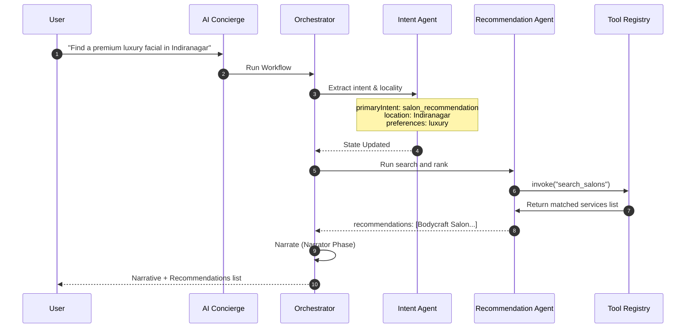
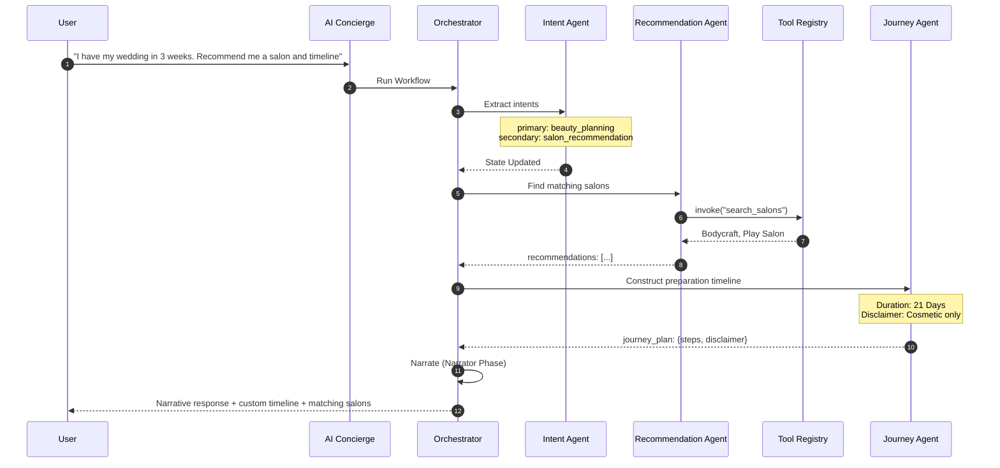

# Aura Agent Workflows

This document outlines the operational sequences, state transitions, and tool invocations of key user workflows.

---

## Workflow A: Simple Salon Recommendation

- **Input**: "Find a premium luxury facial in Indiranagar"
- **Detected Intent**: `salon_recommendation`
- **Agents Selected**: `intent`, `recommendation`
- **Tools Called**: `get_user_profile`, `search_salons`, `get_salon_by_id`
- **State Transitions**:
  - `intent`: null -> `salon_recommendation`
  - `entities`: `{ "location": "Indiranagar", "isLuxury": True }`
  - `recommendations`: `[]` -> `[{"id": "bodycraft-indiranagar", "name": "Bodycraft Salon & Spa", "matchScore": 96, "reasons": [...]}]`
- **Final Output**: Narrative response describing Bodycraft Indiranagar's Hydra Facial, explaining that it is a luxury match under the Indiranagar locality.

---

## Workflow B: Wedding Beauty Planning + Salon Recommendation

- **Input**: "I have my wedding in 3 weeks. Recommend me a salon in Indiranagar under 5000"
- **Detected Intent**: `beauty_planning` (primary), `salon_recommendation` (secondary)
- **Agents Selected**: `intent`, `recommendation`, `journey`
- **Tools Called**: `search_salons`, `get_salon_by_id`
- **State Transitions**:
  - `intent`: `beauty_planning`
  - `journey_plan`: timeline steps, medical disclaimer, and precautions.
  - `recommendations`: Bodycraft Salon matching budget and location constraints.
- **Final Output**: Customized 3-week wedding preparation calendar with recommended services, side-effects precautions, and Bodycraft recommendations.

---

## Workflow C: Salon Comparison + Review Intelligence

- **Input**: "Compare Bodycraft and Play Salon reviews"
- **Detected Intent**: `salon_comparison`
- **Agents Selected**: `intent`, `recommendation`, `review`
- **Tools Called**: `search_salons`, `get_salon_by_id`, `compare_salons`
- **State Transitions**:
  - `intent`: `salon_comparison`
  - `comparison`: Structured metrics compare ratings, pros, cons, and customer sentiments.
- **Final Output**: Narrative summary detailing the pros and cons of both salons (e.g. Bodycraft is best for Hydra facials but busy on weekends; Play Salon has celebrity styling but premium pricing) and recommending the top matches.

---

## Workflow D: Booking Assistance with Confirmation

- **Input**: "Book a Precision French Haircut at Play Salon next Friday at 2:00 PM"
- **Detected Intent**: `booking_assistance`
- **Agents Selected**: `intent`, `booking`
- **Tools Called**: `get_salon_by_id`, `create_booking_draft`
- **State Transitions**:
  - `intent`: `booking_assistance`
  - `booking_draft`: Draft booking structure with `status: "Draft"` and `requiresConfirmation: True`.
- **Final Output**: Narrative prompt: "I have prepared a draft to book your Precision French Haircut at Play Salon. Please confirm if you'd like to schedule this booking!"
