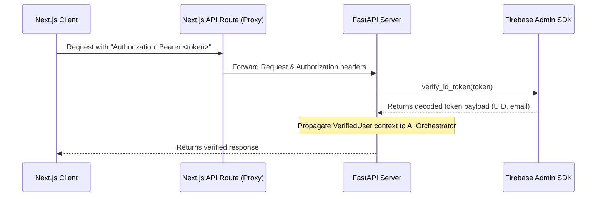

# Authentication and AI Memory Flow

This document details the request lifecycle, cryptographic authentication verify workflow, and persistent user-scoped AI Memory management.

---

## 1. Authentication Lifecycle

### Authorization Header Propagation
1. **Next.js Client**: The browser frontend includes the Firebase ID token in the `Authorization: Bearer <token>` header of requests to Next.js API routes (`/api/ai/agent` and `/api/concierge`).
2. **Next.js API Routes**: Read the incoming `Authorization` header and proxy it directly in headers forwarded to the FastAPI backend service.
3. **FastAPI Security Dependency**: The `get_current_user` dependency intercepts the HTTP Bearer header, validates it cryptographically against Firebase servers via the Firebase Admin SDK, and extracts the verified `uid` and `email`. Any user payload supplying a client-side `userId` in the POST body is overridden by the trusted, cryptographically-signed `uid`.

---

## 2. User-Scoped AI Memory Persistence

### Storage Model
Instead of storing memory as an ephemeral dictionary in runtime memory, `MemoryManager` persists memory context directly inside Firestore.
* **Document Location**: `users/{uid}`
* **Memory Property**: `aiMemory` (contains a serialized JSON representation of the `UserMemory` object)

### Read/Write Lifecycle
1. **Load User Memory**:
   * Fetch the `users/{uid}` document.
   * If the `aiMemory` property exists, deserialize it into a `UserMemory` object.
   * If the property does not exist or fails validation, construct a fresh, empty `UserMemory` instance for that user.
2. **Save User Memory**:
   * Serialize `UserMemory` containing updated interaction queries, explicit preferences, and shortlists.
   * Perform a Firestore merge write (`set(..., merge=True)`) on `users/{uid}` targeting the `aiMemory` key. This preserves all other profile parameters (such as email, name, role) while updating AI state atomically.
