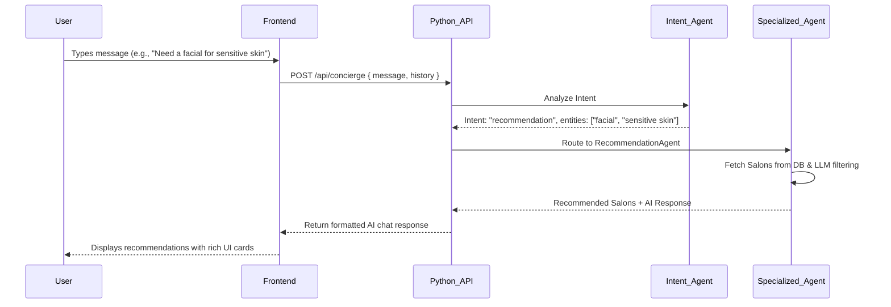
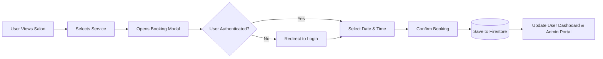
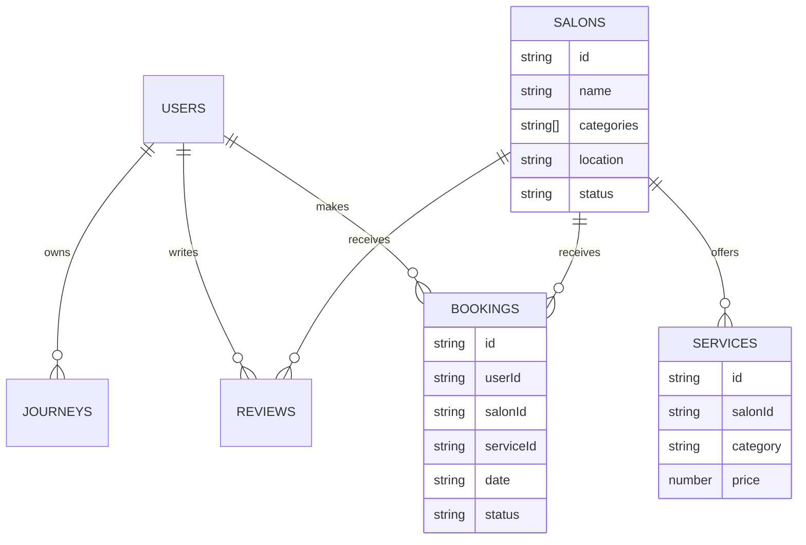

# AuraAI Detailed Project Workflow

This document provides a comprehensive workflow of the AuraAI Beauty Marketplace, illustrating how data and interactions flow between the user interface, the AI concierge system, and the backend services.

## High-Level Architecture Overview

AuraAI is structured as a full-stack Next.js application that integrates with Firebase (Firestore, Auth) and an AI Python Backend for intelligent processing. 

> [!NOTE]
> The AI backend utilizes a multi-agent system (coordinated via `AgentRegistry`) to handle specialized tasks such as understanding intent, generating journeys, and recommending salons.

```mermaid
graph TD
    %% Define styles
    classDef client fill:#plum,stroke:#333,stroke-width:2px,color:white
    classDef ai fill:#sage,stroke:#333,stroke-width:2px,color:white
    classDef db fill:#peach,stroke:#333,stroke-width:2px,color:white

    User((User)) --> |Interacts| NextJS[Next.js Frontend\nApp Router]
    NextJS --> |Auth & Data Sync| Firebase[(Firebase\nFirestore & Auth)]
    NextJS --> |REST API Calls| PythonAPI[Python Backend API]
    PythonAPI --> |Orchestrates| AgentRegistry[AI Agent Registry]
    
    AgentRegistry --> IntentAgent[Intent Agent]
    AgentRegistry --> RecAgent[Recommendation Agent]
    AgentRegistry --> JourneyAgent[Journey Agent]
    AgentRegistry --> ReviewAgent[Review Agent]
    AgentRegistry --> BookingAgent[Booking Agent]
    
    IntentAgent & RecAgent & JourneyAgent & ReviewAgent & BookingAgent --> |Context| LLMProvider[LLM Provider\n(Gemini)]
```

---

## 1. User Journey & Core Workflows

### A. AI Concierge & Chat Workflow

The AI Concierge is the central nervous system for natural language interaction.



### B. Beauty Journey Generation Workflow

Users can generate personalized, multi-step beauty routines (e.g., "Wedding Prep", "Monthly Self-Care").

1. **User Request:** User provides a goal, budget, and timeline to the Journey feature.
2. **AI Processing:** The backend routes the request to the `JourneyAgent`.
3. **Step Creation:** The LLM structures a timeline (e.g., 6 weeks out, 2 weeks out, 1 day out) and maps necessary services to each milestone.
4. **Service Matching:** For each service step, the `RecommendationAgent` dynamically finds the best matching salons nearby.
5. **Progress Tracking:** The resulting journey is saved to Firestore, allowing the user to mark steps as "Completed" and track progress over time.

### C. Booking Workflow



### D. Admin Portal & Catalog Management

The admin portal provides owners/managers full control over the marketplace.

- **Salon CRUD:** Admins can add/edit salons, setting up localities, addresses, profile images, and assigning **multiple categories** (Hair, Skin, Bridal, Nails, Spa, Premium).
- **Service Management:** Admins define catalog items (Name, Category, Price, Duration) linked to specific salons.
- **Booking Management:** Admins can view all incoming bookings and update their status (Pending -> Confirmed -> In Progress -> Completed -> Cancelled).
- **Real-time Sync:** Changes in the admin portal immediately reflect on the user-facing Marketplace (via Firebase real-time snapshot listeners in `AppContext.tsx`).

---

## 2. Frontend State Management

The frontend heavily utilizes React Context (`AppContext.tsx` and `AuthContext.tsx`) to maintain global state.

> [!TIP]
> **Simulated Auth Mode:** If Firebase credentials are missing, the app gracefully degrades to use `localStorage` with `MOCK_SALONS` and simulated users, ensuring the app is always functional for demonstration.

- **Data Aggregation:** `AppContext` fetches raw `dbSalons` and `dbServices` from Firestore. It aggregates these into a unified `salons` array (mapping services into their respective salon objects).
- **Auto-tagging:** If an admin hasn't explicitly set categories for a salon, the frontend automatically derives them based on the categories of the salon's underlying services.

## 3. Data Schema Relationships


